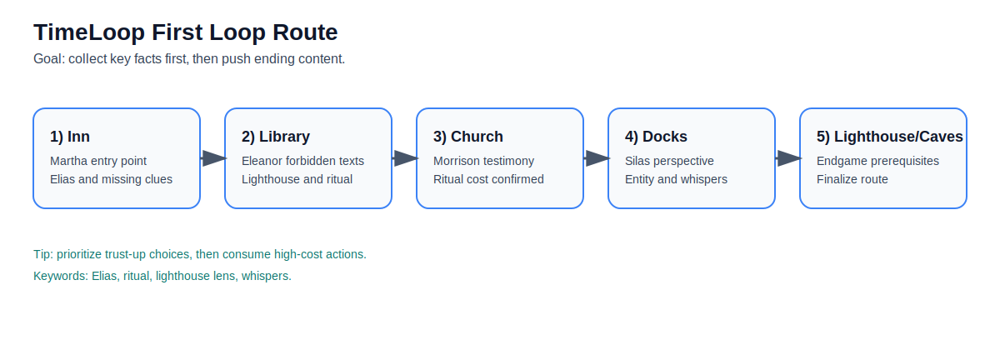
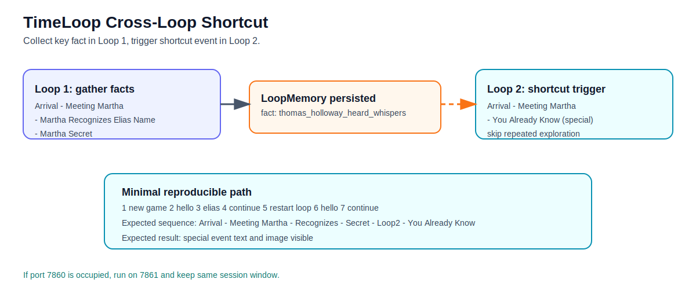

# TimeLoop 游玩指南（快速上手 + 高效通关）

## 1. 启动与准备

### 1.1 环境准备

1. 安装依赖：
   - `pip install -r requirements.txt`
2. 配置密钥：
   - 复制 `.env.example` 为 `.env`
   - 填写 `OPENAI_API_KEY`
   - 如使用 SiliconFlow，设置 `OPENAI_BASE_URL=https://api.siliconflow.cn/v1`

### 1.2 启动方式

- 默认启动：`python main.py`
- 默认端口通常为 `7860`；若被占用可改端口，例如：
  - Windows: `set PORT=7861&& python main.py`

打开浏览器访问对应地址即可开始。

## 2. UI 功能说明

- 左侧：
  - 地图（当前地点/已访问地点/NPC 所在地）
  - 状态栏（理智、时间、循环次数、已知事实）
- 中间：
  - 当前场景叙事（含事件标题、对话、事件插图）
  - 选项按钮（常规 3 个 + 可能出现“前世记忆”特殊选项）
  - 自由文本输入框（可直接自然语言行动）
- 底部：
  - 事件时间线（已完成/可达/锁定）

## 3. 核心机制（先理解再玩）

### 3.1 时间循环

- 一天会推进至午夜；循环重开后，部分记忆会保留；
- 循环越多，初始理智与可用时间会更紧张。

### 3.2 双层记忆

- `GameState`：本轮即时状态（地点、信任、背包、标记）；
- `LoopMemory`：跨循环累积信息（已知事实、NPC 历史最高信任、结局经历）。

### 3.3 理智（Sanity）

- 理智会影响叙事风格与可用策略；
- 低理智有时能触发特殊叙事视角，但会增加不确定性。

### 3.4 信任与信息解锁

- NPC 信任是关键门槛；
- 同一句话在不同语气/时机下可能造成正向或负向信任变化。

## 4. 推荐游玩路线（首轮）

首轮目标：尽量完整地“铺信息”，不要急着追求结局。

推荐顺序：

1. 旅馆（Martha）拿到失踪线索；
2. 图书馆（Eleanor）推进禁书与灯塔信息；
3. 教堂（Morrison）确认仪式相关事实；
4. 码头（Silas）补全“海中低语/实体”视角；
5. 形成“人-地点-仪式”关系图后，再冲灯塔/洞穴。

操作建议：

- 优先点“增信任”的对话分支；
- 对关键名词可用自由输入反复追问（如“伊莱亚斯”“仪式”“灯塔透镜”）；
- 避免在信息不足时过早消耗大量理智。

## 5. 高效触发“特殊事件”的最短测试路径

下面这条路径已验证可触发跨循环特殊事件 `You Already Know / 你已经知道了`：

1. 新游戏（自动触发 `Arrival at Ravenhollow`）
2. 输入任意文本（例如 `hello`）-> `Meeting Martha`
3. 输入 `elias`（或含“伊莱亚斯”）-> `Martha Recognizes Elias's Name`
4. 再输入任意文本（例如 `continue`）-> `Martha's Secret`
5. 点击“重启循环”
6. 输入任意文本（例如 `hello`）-> `Meeting Martha`
7. 再输入任意文本（例如 `continue`）-> 触发 `You Already Know`

如果你想验证“特殊事件图片是否正常”，可在该路径中观察当前场景上方事件插图是否出现。

## 6. 常见问题（FAQ）

### Q1：为什么我输入了很多话还是在同一地点？

可能原因：

- 当前输入被判定为 `TALK/INVESTIGATE`，而不是移动意图；
- 该地点有高优先级事件尚未触发完。

建议：

- 直接输入“去教堂/去码头/去图书馆”等明确移动表达；
- 或先完成当前 NPC 关键对话节点。

### Q2：为什么有时出现英文叙事？

通常与模型输出解析失败或回退路径有关（少量边缘情况）。  
可通过再次输入简短动作（如“继续”）让状态恢复稳定。

### Q3：为什么信任突然下降？

系统会根据语气与问题敏感度调整信任。  
“逼问”“质疑”“揭短”在某些 NPC 场景中会触发负向变化。

### Q4：事件图不显示怎么办？

- 确认启动目录是项目根目录；
- 若 `7860` 被占用，换端口重启；
- 当前版本事件图路径基于绝对路径与 Gradio 文件路由，正常情况下应可显示。

## 7. 进阶建议（想拿真结局）

- 第二轮开始优先利用“前世记忆”相关对话，跳过低价值探索；
- 在关键 NPC 之间建立互证链（Martha -> Eleanor -> Morrison -> Silas）；
- 进入终局前尽量确保：  
  - 灯塔相关线索到位；  
  - 洞穴入口信息已知；  
  - 至少 1-2 名关键 NPC 信任达标。

---

已附图：

- `first_loop_route.svg`（首轮路线图）
- `cross_loop_shortcut.svg`（跨循环捷径图）

